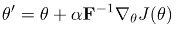
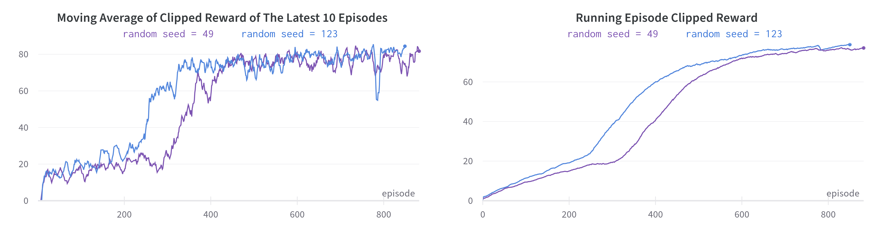
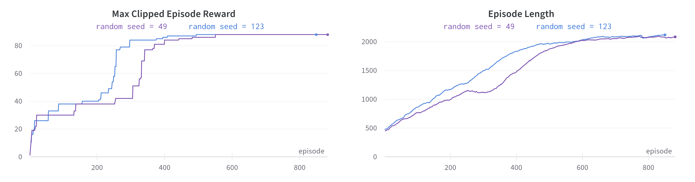
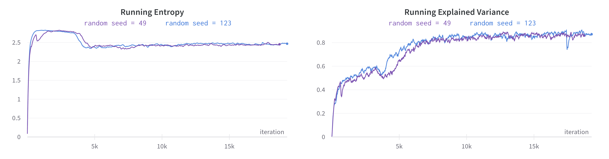
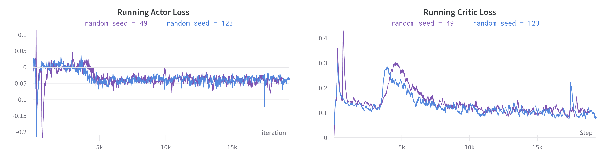
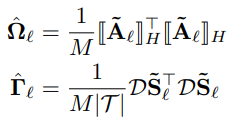
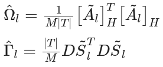

[](https://makeapullrequest.com)

# ACKTR-PyTorch
>This repository is a PyTorch implementation of the _Scalable trust-region method for deep reinforcement learning using Kronecker-factored approximation_ paper also known as ACKTR.

Natural Gradients is the popular and powerful method of choice whenever second order optimization is considered. But its computation involves inverting the Fisher Information Matrix that for deep neural networks will have astronomical dimensions thus, impractical to use.  
<p align="center">
  
</p>  

KFAC optimizer introduced approximations to the Fisher information Matrix that made it capable to be used in the regime of deep neural nets. ACKTR took advantage of this possibility and managed to train an A2C agent (the synchronous version of A3C) and showed both improvements in performance and more importantly the sample efficiency that was promised in the first place.

## Demo
Seaquest | MsPacman
:------------:|:---------------:
|

## Results
> Environment: SeaquestNoFrameskip-v4  
> Number of workers: 8

<p align="center">
  
</p>  
<p align="center">
  
</p>  
<p align="center">
  
</p>  
<p align="center">
  
</p>  

## What's different in this repository
If you take a look at other popular repositories that I have mentioned in the [acknowledgement](#acknowledgement) section as well,  you will find that in order to compute **Γ** and **Ω** matrices for convolutional layers, they have divided the by the spatial size of the convolution operator.
To be concrete, they all have done the following division and multiplication that I have brought form  [baselines](https://github.com/openai/baselines) and [KFAC-Pytorch](https://github.com/alecwangcq/KFAC-Pytorch)  as the code references that are commonly refered to:

>[baselines](https://github.com/openai/baselines/blob/ea25b9e8b234e6ee1bca43083f8f3cf974143998/baselines/acktr/kfac.py#L374) when computing Ω:
```python
fpropFactor = tf.concat([fpropFactor, tf.ones([tf.shape(fpropFactor)[0], 1]) / Oh / Ow], 1) # Division by Oh and Ow is equivalent to the division by the spatial size              
```
>[baselines](https://github.com/openai/baselines/blob/ea25b9e8b234e6ee1bca43083f8f3cf974143998/baselines/acktr/kfac.py#L407) when computing Γ:
```python
bpropFactor = tf.reshape(bpropFactor, [-1, C]) * Oh * Ow            
```
>[KFAC-Pytorch](https://github.com/alecwangcq/KFAC-Pytorch/blob/25e6dbe14752348d4f6030697b4b7f553ead2e92/utils/kfac_utils.py#L116) when computing Ω: (They are already in doubt!)
```python
def conv2d(a, layer):
    batch_size = a.size(0)
    a = _extract_patches(a, layer.kernel_size, layer.stride, layer.padding)
    spatial_size = a.size(1) * a.size(2)
    a = a.view(-1, a.size(-1))
    if layer.bias is not None:
       a = torch.cat([a, a.new(a.size(0), 1).fill_(1)], 1)
    a = a/spatial_size
    # FIXME(CW): do we need to divide the output feature map's size? P.S: [Are the original maintainers in doubt???]
    return a.t() @ (a / batch_size)           
```
>[KFAC-Pytorch](https://github.com/alecwangcq/KFAC-Pytorch/blob/25e6dbe14752348d4f6030697b4b7f553ead2e92/utils/kfac_utils.py#L165) when computing Γ:
```python
def conv2d(g, layer, batch_averaged):
    # g: batch_size * n_filters * out_h * out_w
    # n_filters is actually the output dimension (analogous to Linear layer)
    spatial_size = g.size(2) * g.size(3)
    batch_size = g.shape[0]
    g = g.transpose(1, 2).transpose(2, 3)
    g = try_contiguous(g)
    g = g.view(-1, g.size(-1))

    if batch_averaged:
        g = g * batch_size
    g = g * spatial_size
    cov_g = g.t() @ (g / g.size(0))

        return cov_g       
```
### BUT:
The [original paper](https://arxiv.org/abs/1602.01407) at page 11 has presented following equations to compute **Γ** and **ψ**:
<p align="center">
  
</p>  
While, what those codes are computing is equal to the followings:
<p align="center">
  
</p>  

### SO:
I stuck with the paper and avoid such unexplained operations and instead did the followings: 
>[brain/kfac.py](https://github.com/alirezakazemipour/ACKTR-PyTorch/blob/d7e5b23095ede10c7241a46015cb9370b6bd5349/brain/kfac.py#L50) when computing Ω:
```python
def _save_aa(self, layer, layer_input):
   if torch.is_grad_enabled() and self._k % self.Ts == 0:
       a = layer_input[0].data
       batch_size = a.size(0)
       if isinstance(layer, Conv2d):
           a = img2col(a, layer.kernel_size, layer.stride, layer.padding)

       if layer.bias is not None:
           a = torch.cat([a, a.new(a.size(0), 1).fill_(1)], 1)

       aa = (a.t() @ a) / batch_size

       if self._k == 0:
           self._aa_hat[layer] = aa.clone()

       polyak_avg(aa, self._aa_hat[layer], self.eps)         
```
>[brain/kfac.py](https://github.com/alirezakazemipour/ACKTR-PyTorch/blob/d7e5b23095ede10c7241a46015cb9370b6bd5349/brain/kfac.py#L78) when computing Γ:
```python
def _save_gg(self, layer, delta, grad_backprop):  # noqa
    if self.fisher_backprop:
        ds = grad_backprop[0]
        batch_size = ds.size(0)
        if self._k % self.Ts == 0:
            if isinstance(layer, Conv2d):
                ow, oh = ds.shape[-2:]
                ds = ds.transpose_(1, 2).transpose_(2, 3).contiguous()
                ds = ds.view(-1, ds.size(-1))

            ds *= batch_size
            gg = (ds.t() @ ds) / batch_size / oh / ow if isinstance(layer, Conv2d) else (ds.t() @ ds) / batch_size

            if self._k == 0:
                self._gg_hat[layer] = gg.clone()

            polyak_avg(gg, self._gg_hat[layer], self.eps)    
```

## Dependencies
- gym == 0.24.1
- numpy == 1.23.1
- opencv_python == 4.6.0.66
- psutil == 5.9.1
- torch == 1.12.0
- tqdm == 4.64.0
- wandb == 0.12.21

## Usage
```bash
python main.py --interval=500 --train_from_scratch --online_wandb --env_name="SeaquestNoFrameskip-v4"
```
```bash
usage: main.py [-h] [--env_name ENV_NAME] [--num_worker NUM_WORKER]
               [--total_iterations TOTAL_ITERATIONS] [--interval INTERVAL]
               [--online_wandb] [--do_test] [--render] [--train_from_scratch]
               [--seed SEED]

Variable parameters based on the configuration of the machine or user's choice

options:
  -h, --help            show this help message and exit
  --env_name ENV_NAME   Name of the environment.
  --num_worker NUM_WORKER
                        Number of parallel workers. (-1) to use as many as cpu
                        cores.
  --total_iterations TOTAL_ITERATIONS
                        The total number of iterations.
  --interval INTERVAL   The interval specifies how often different parameters
                        should be saved and printed, counted by iterations.
  --online_wandb        Run wandb in online mode.
  --do_test             The flag determines whether to train the agent or play
                        with it.
  --train_from_scratch  The flag determines whether to train from scratch or
                        continue the last try.
  --seed SEED           The random seed.
```
###  Considerations
- You can put your _wandb API key_ in a file named `api_key.wandb` at the root directory of the project and the code will automatically read the key and as a result, there will be no need to insert your wandb credentials each time:
```python
def init_wandb(online_mode=False):
    if os.path.exists("api_key.wandb"):
        with open("api_key.wandb", 'r') as f:
            os.environ["WANDB_API_KEY"] = f.read()
            if not online_mode:
                os.environ["WANDB_MODE"] = "offline"
    else:
        if not online_mode:
            os.environ["WANDB_MODE"] = "offline"
        key = input("Please enter your wandb api key then press enter:")
        wandb.login(key=key)
```
- At the time of testing, the code by default uses the weights of the latest run available in _`weights`_ folder because each subdirectory is named by the time and the date (e.g. 2022-07-13-06-51-32 indicating 7/13/2022, 6:51:32) that the code was executed correspondingly so, please bear in mind to put your desired `*.pth` file in the appropriate subdirectory inside the _`weights`_ directory! 👇
> common/logger.py:
```python
def load_weights(self):
    model_dir = glob.glob("weights/*")
    model_dir.sort()
    self.log_dir = model_dir[-1].split(os.sep)[-1]
    checkpoint = torch.load("weights/" + self.log_dir + "/params.pth")

    self.brain.model.load_state_dict(checkpoint["model_state_dict"])
    self.brain.optimizer.load_state_dict(checkpoint["optimizer_state_dict"])

    self.running_last_10_r = checkpoint["running_last_10_r"]
    self.running_training_logs = np.asarray(checkpoint["running_training_logs"])
    self.running_reward = checkpoint["running_reward"]

    if not self.config["do_test"] and not self.config["train_from_scratch"]:
    wandb.init(project="ACKTR",  # noqa
               config=self.config,
               job_type="train",
               name=self.log_dir
               )
    return checkpoint["iteration"], checkpoint["episode"]
```

## References
1. [_Optimizing Neural Networks with Kronecker-factored Approximate Curvature_, Martens, et al., 2015](https://arxiv.org/abs/1503.05671)
2. [_A Kronecker-factored approximate Fisher matrix for convolution layers_, Martens et al., 2016](https://arxiv.org/abs/1602.01407)
3. [_Scalable trust-region method for deep reinforcement learning using Kronecker-factored approximation_, Wu et al., 2017](https://arxiv.org/abs/1708.05144)

## Acknowledgement
Following repositories were great guides to build up the current repository. Big thanks to them for their works and you can find them very handy if you're interested in more advanced implementations of KFAC or ACKTR:
1. [KFAC-Pytorch](https://github.com/alecwangcq/KFAC-Pytorch) by [@alecwangcq](https://github.com/alecwangcq)
2. [pytorch-a2c-ppo-acktr-gail](https://github.com/ikostrikov/pytorch-a2c-ppo-acktr-gail) by [@ikostrikov](https://github.com/ikostrikov)
3. [baselines](https://github.com/openai/baselines) by [@OpenAI](https://github.com/openai)
